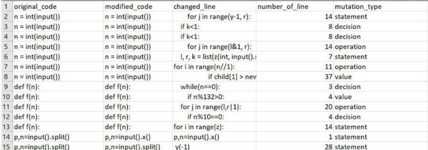
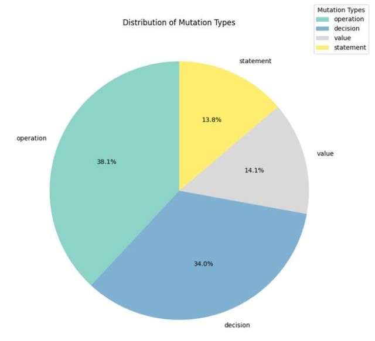
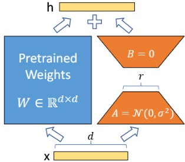
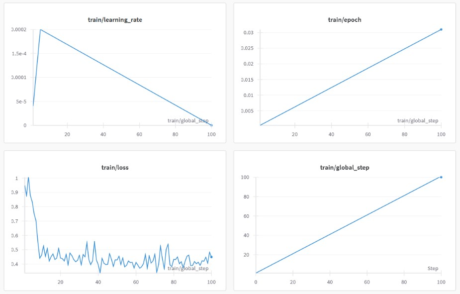
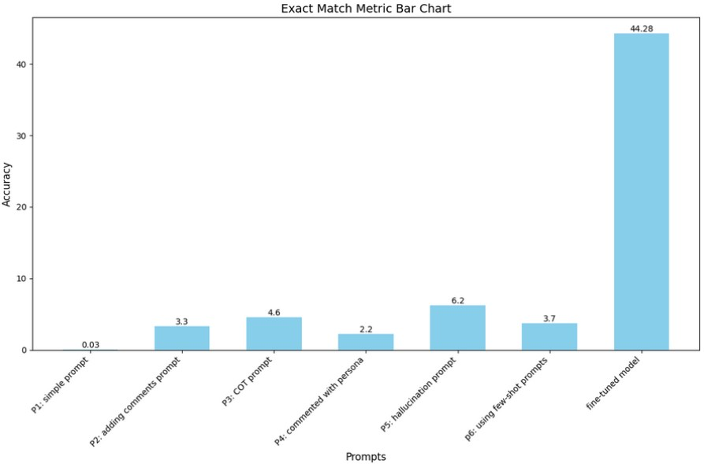
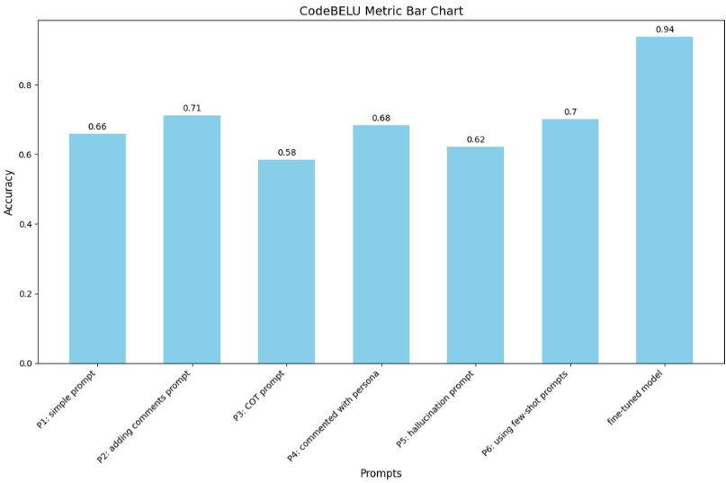
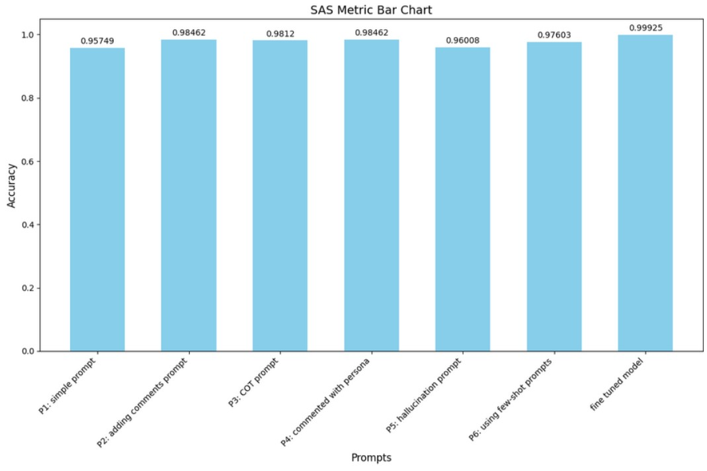
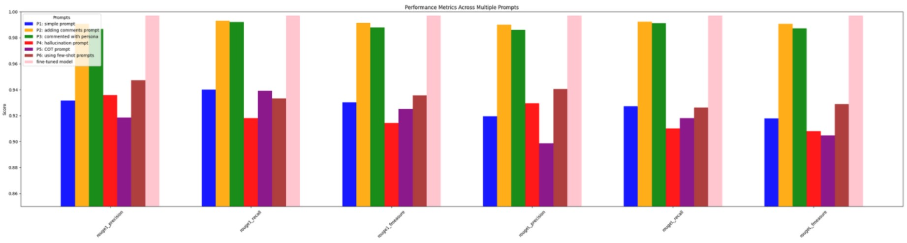
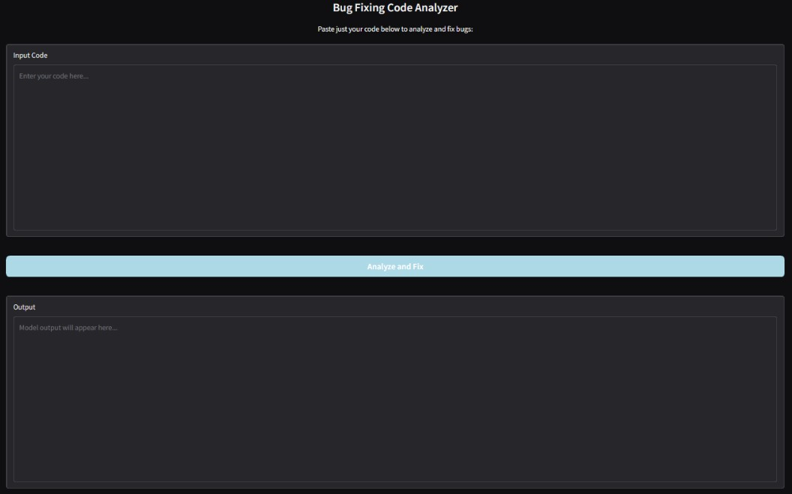

# Feasibility of Bug Detection and Bug Fixing Using Prompt Engineering and Fine-Tuning in Large Language Models

## Overview
This repository hosts the project dedicated to evaluating the feasibility of detecting and fixing bugs using prompt engineering and fine-tuning techniques in large language models (LLMs). The project utilizes a custom dataset and innovative methods to enhance the LLM's capabilities in understanding and correcting code errors. Here are the topics in this project:
- [Dataset Description](#dataset-description)
- [Dataset Creation Process](#dataset-creation-process)
- [Model Description](#model-description)
- [Prompt Engineering](#prompt-engineering)
- [Fine-Tuning](#fine-tuning)
- [Evaluation Metrics](#evaluation-metrics)
- [Conclusion](#conclusion)
- [User Interface](#user-interface)
- [How to Use](#how-to-use)

## Dataset Description
The dataset, named `bug_evaluation_dataset`, is meticulously crafted to train and test LLMs specifically for bug detection and correction tasks. It comprises 25,793 rows, each containing:
- `original_code`: The buggy code snippet.
- `modified_code`: The corrected code snippet.
- `changed_line`: The specific line in the code where the bug was fixed.
- `number_of_line`: The line number of the corrected code.
- `mutation_type`: Type of bug introduced; includes Operation, Decision, Value, and Statement mutations.

This dataset was generated using Mutation Testing techniques to systematically introduce bugs into existing clean code. The types of mutations are designed to simulate common logical and syntactic errors developers might encounter.

    
    

## Dataset Creation Process
The dataset was curated through a semi-automated process:
1. **Code Extraction**: Clean code snippets were extracted from open-source repositories.
2. **Mutation Injection**: Bugs were introduced into the clean code using predefined mutation rules to alter specific parts of the code logically.
3. **Data Compilation**: Each entry in the dataset includes the bugged code, the fix, the location of the fix, and the type of mutation, prepared for LLM training and evaluation.

## Model Description
The backbone of our fine-tuning experiments is the [Unsloth Meta-Llama 3.1-8B](https://github.com/unslothai/unsloth) model, renowned for its high performance in natural language understanding and generation tasks, including code generation and debugging. This model's capabilities make it ideally suited for addressing complex tasks involved in software debugging.

## Prompt Engineering
Prompt engineering involves crafting and testing prompts that effectively guide LLMs to recognize and fix code errors. The process is detailed in the `Prompt_Engineering.ipynb` notebook, where different prompt formats and their impact on the LLM’s performance are explored. We introduced the `6` type of prompt that are used in the model. 

<table>
 
  <thead>
    <tr>
      <th>
          Prompts
      </th>
      <th>
          Explanations
      </th>
    </tr>
  </thead>
  
  <tbody>
    <tr>
      <td align="center">
           P1: Direct Instruction Prompts
      </td>
      <td align="center">
            These prompts explicitly instruct the model to identify and fix errors in the code, using clear and direct language to guide the model's response.
      </td>
    </tr>
  </tbody>
  
  <tbody>
    <tr>
      <td align="center">
           P2: Contextual Prompts
      </td>
      <td align="center">
           These prompts provide additional context about the purpose or functionality of the code, helping the model understand the intended behavior and identify discrepancies.
      </td>
    </tr>

  </tbody>
  
  <tbody>
    <tr>
      <td align="center">
           P3: Error Description Prompts
      </td>
      <td align="center">
           These involve describing a known error within the code and asking the model to correct it, which helps in scenarios where specific bug types are targeted.
      </td>
    </tr>
  </tbody>
  
  <tbody>
    <tr>
      <td align="center">
         P4: Comparative Prompts
      </td>
      <td align="center">
These prompts involve comparing the buggy code to a similar, but correct, code snippet to guide the model in understanding the corrections needed.
      </td>
    </tr>
  </tbody>
  
  <tbody>
    <tr>
      <td align="center">
          P5: Test Case Prompts
      </td>
      <td align="center">
          Involving test cases that the code must pass, these prompts help the model focus on producing a valid output that meets specified conditions, enhancing its debugging capabilities.
      </td>
    </tr>
  </tbody>
  
  <tbody>
    <tr>
      <td align="center">
          P6: Iterative Refinement Prompts
      </td>
      <td align="center">
          These prompts ask the model to iteratively refine the code based on feedback or errors identified in previous attempts, encouraging a more detailed focus on incremental improvements.
      </td>
    </tr>
  </tbody>
  
</table>

## Fine-Tuning
In this project, fine-tuning is aimed at adapting the model to the coding domain, especially for bug detection and debugging. The model is trained on a dataset of code with errors and corresponding corrections, allowing it to learn patterns for identifying and fixing programming issues. The LoRA method is employed to efficiently adjust the model's weights, optimizing the fine-tuning process by reducing computational demand. This process enhances the model's ability to accurately detect and resolve bugs, ensuring it can provide effective code debugging suggestions while still generalizing well to other tasks. Fine-tuning, combined with LoRA, ensures that the model can handle the specific challenges of bug detection in programming with minimal resource requirements.

    
    

## Evaluation Metrics
To assess the effectiveness of the model post-training, several metrics are employed:
- **Exact Match**: Measures the percentage of instances where the model’s output exactly matches the expected corrected code.
- **CodeBLEU**: Assesses code similarity considering syntax and semantic correctness.
- **ROUGE**: Evaluate the overlap of n-grams between the model’s output and the target code.
- **SAS**: A syntax-aware semantic evaluation metric focusing on the logical correctness of the code.

    
    
    
    

## Conclusion
As a result of the command line, the command line number two has the greatest impact on improving the results of the language model, and similarly, fine-tuning the model has yielded significant results in the responses of the Llama 3 model.

## User Interface
This user interface is designed for a `Bug Fixing Code Analyzer` tool. It allows users to input their code in the "Input Code" section, where they can analyze and identify bugs. After entering the code, users can click the "Analyze and Fix" button to initiate the process, and the tool will analyze the code and suggest potential fixes. The results are displayed in the "Output" section, providing the user with the model's output, which includes both the identified errors and improvements in the code. The design is clean and user-friendly, making it easy for users to input their code and receive feedback on the fly. The UI is intended to streamline the debugging process and make coding tasks more efficient.

    

## How to Use
To replicate the experiments or utilize the methodologies:
1. Clone the repository.
2. Ensure you have the required computing resources and dependencies installed.
3. Follow the instructions in each notebook to train or evaluate the model.

Additionally, you can access the fine-tuned model via Hugging Face: 
[Fine-tuned Llama 3.1 8B - Bug Fixing](https://huggingface.co/navidadkhah/Fine-tuned-Llama-3.1-8B-bug-fixing)

You can also access the dataset used for training the model here: 
[Fine-tuned Llama 3.1 8B - Bug Fixing Dataset](https://huggingface.co/datasets/navidadkhah/bug_evaluation_dataset)
